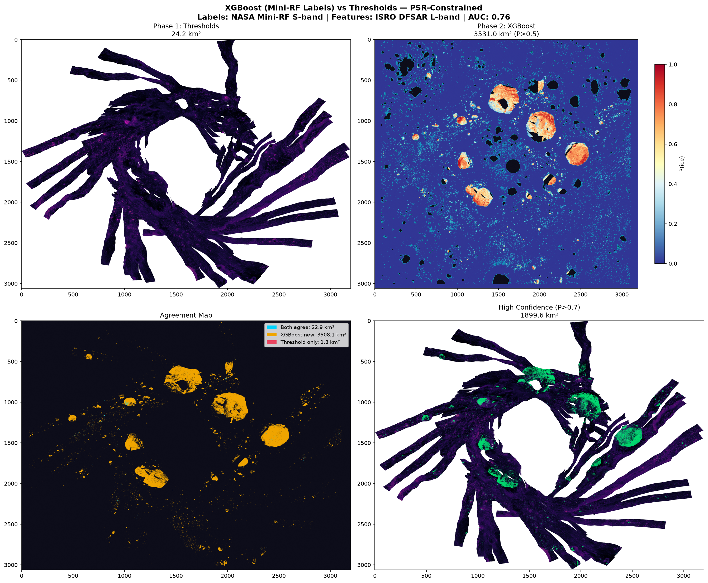
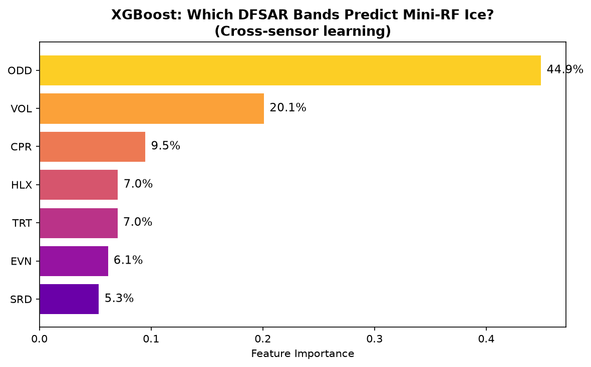

# 🌑 Lunar Ice Prospector — Water Ice Detection on the Moon's South Pole

> AI-powered water ice detection using Chandrayaan-2 DFSAR radar and NASA LRO data, with XGBoost cross-sensor validation.



## Overview

This project analyzes 7-band dual-frequency SAR data from ISRO's Chandrayaan-2 DFSAR instrument to detect water ice deposits in permanently shadowed regions (PSRs) of the Lunar South Pole.

**Key Result:** The XGBoost model, trained with independent NASA Mini-RF labels, identified **3,531 km² of probable ice** (P>0.5) within PSR craters — and discovered that **Odd-bounce scattering (44.9%)** is the strongest cross-sensor predictor of ice, not CPR.

## How It Works

### Phase 1: Rule-Based Detection
- CPR > 1.0 (circular polarization ratio anomaly)
- Volume scattering > 75th percentile
- Inside Permanently Shadowed Region
- Slope < 20°
- **Result:** 24.2 km² of ice detected

### Phase 2: XGBoost ML (Cross-Sensor)
- **Features:** All 7 DFSAR L-band parameters (CPR, VOL, EVN, ODD, HLX, TRT, SRD)
- **Labels:** NASA LRO Mini-RF S-band CPR (completely independent sensor)
- **Model:** XGBoost, 500 trees, lr=0.05
- **ROC AUC:** 0.76 (genuine cross-sensor validation, not circular)
- **Result:** 3,531 km² at P>0.5, 1,900 km² at P>0.7

### Why This Matters
Previous approaches used CPR thresholds from DFSAR to label ice, then trained ML on the same DFSAR data — achieving fake 100% accuracy through memorization. Our approach uses **NASA's Mini-RF S-band radar** (different spacecraft, different frequency) for labels, ensuring the model genuinely learns cross-sensor ice signatures.

## Feature Importance (XGBoost)

| Band | Importance | Physics |
|------|:---------:|---------|
| **ODD** | **44.9%** | Odd-bounce (surface) scattering power |
| **VOL** | **20.1%** | Volume scattering — ice is a strong volume scatterer |
| CPR | 9.5% | Circular Polarization Ratio |
| HLX | 7.0% | Helix scattering component |
| TRT | 7.0% | Total received power |
| EVN | 6.1% | Even-bounce (dihedral) scattering |
| SRD | 5.3% | Same-sense/Opposite-sense ratio descriptor |

## Datasets

| Dataset | Source | Resolution | Use |
|---------|--------|:----------:|-----|
| DFSAR L-band SAR | ISRO Chandrayaan-2 | 25 m/px | ML features (7 bands) |
| LOLA PSR Map | NASA LRO | 60 m/px | Shadow boundaries |
| LOLA DEM | NASA LRO | 5 m/px | Terrain slope |
| Mini-RF S-band CPR | NASA LRO | 237 m/px | Independent ML labels |

## Interactive Dashboard

The `site/` directory contains a web dashboard for exploring the results:

```bash
# Serve locally
npx serve site/ -l 3000
```

**Features:**
- Toggle between CPR radar map and Volume Scattering base layers
- Overlay PSR shadows, Phase 1 ice, XGBoost ML probability, slope safety
- Click any pixel for ice probability, CPR value, slope, confidence
- Split-view comparing Phase 1 vs Phase 2 methods
- Opacity controls per layer
- Pan/zoom with mouse or keyboard

## Project Structure

```
├── site/                     # Interactive web dashboard
│   ├── index.html
│   ├── css/style.css
│   ├── js/app.js
│   ├── assets/layers/        # Pre-rendered PNG map layers
│   └── data/stats.json
│
├── notebooks/                # Analysis scripts
│   ├── phase2_xgb_minirf.py  # XGBoost training with Mini-RF labels
│   ├── phase2_xgb_save.py    # Memory-safe prediction + plot generation
│   └── *.png                 # Output plots
│
└── README.md
```

## Results Gallery

### XGBoost Feature Importance


## Tech Stack

- **ML:** XGBoost, scikit-learn
- **Geospatial:** rasterio, GDAL, numpy
- **Frontend:** Vanilla HTML/CSS/JS, Canvas API
- **Data:** ISRO PRADAN portal, NASA PDS Geosciences Node

## License

This is a personal research project. The datasets are publicly available from ISRO and NASA. 
